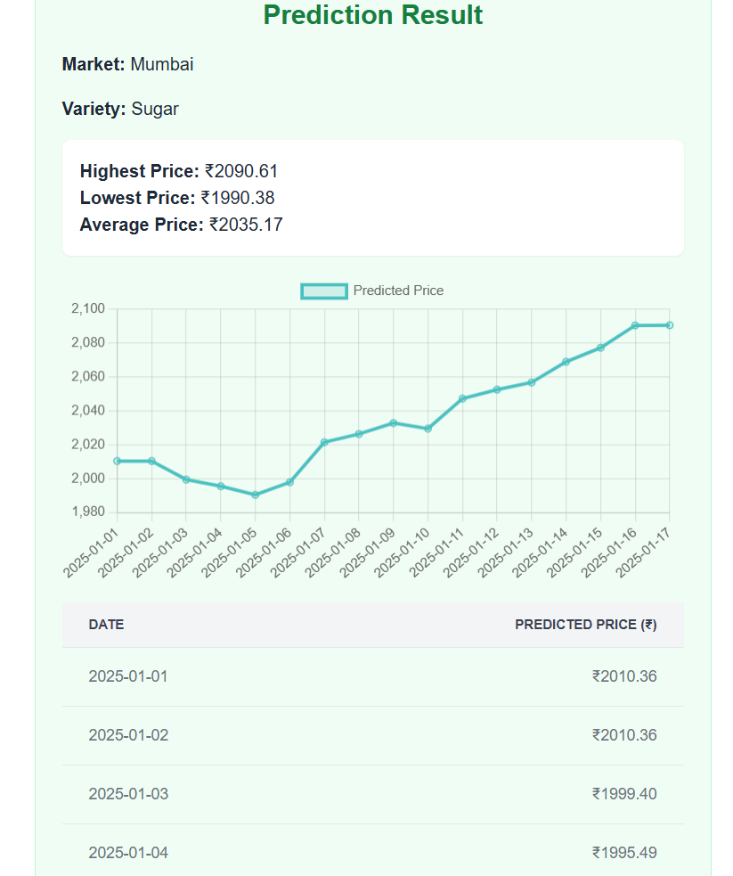

# 🌾 Agri Marketplace Price Forecasting

## 📌 Overview
This project predicts **agricultural commodity prices** for different markets and varieties using **time-series forecasting** and **machine learning (XGBoost)**.  
It processes raw mandi (market) data, engineers meaningful features (lags, rolling means, standard deviations), and trains a regression model to forecast **future prices**.  

The system is deployed via a **Flask API**, allowing users to query price forecasts for specific markets and commodities.

---

## 🔑 Features
- 📊 Data cleaning and preprocessing of mandi prices.  
- 🛠 Feature engineering (lags, rolling stats, arrival-based trends).  
- 🤖 Machine Learning model with **XGBoost Regressor**.  
- 🌐 REST API built using Flask for real-time predictions.  
- 📡 Endpoints for:
  - Price prediction (`/predict`)
  - Fetching available markets (`/markets`)
  - Fetching available varieties per market (`/varieties`)
- 📝 Example client (`send_request.py`) to send POST requests to the API.  

---

## 📂 Project Structure
```
AgriForecast/
│
├── agri_app.py              # Flask backend API
├── agrimarketforecasting.py # Data preprocessing + model training
├── send_request.py          # Client script for API requests
├── EngineeredData.csv       # Processed dataset
├── aissmspricemodel.pkl     # Saved XGBoost model
└── README.md                # Documentation
```

---

## ⚙️ Installation & Setup

### 1️⃣ Clone Repository
```bash
git clone https://github.com/Harshal3459/AgriForecast.git
cd AgriForecast
```

### 2️⃣ Install Dependencies
```bash
pip install -r requirements.txt
```

### 3️⃣ Run Flask API
```bash
python agri_app.py
```
API will start at: `http://127.0.0.1:5000/`

---

## 🌐 API Endpoints

### 🔹 1. Predict Future Prices
**POST** `/predict`

**Request Example:**
```json
{
  "market": "Mumbai",
  "variety": "Sugar",
  "days": 5
}
```

**Response Example:**
```json
{
  "market": "Mumbai",
  "variety": "Sugar",
  "predictions": [
    {"date": "2024-09-01", "price": 2950.75},
    {"date": "2024-09-02", "price": 2961.30},
    {"date": "2024-09-03", "price": 2975.20}
  ]
}
```

---

### 🔹 2. Get Available Markets
**GET** `/markets`

**Response Example:**
```json
{"markets": ["Mumbai", "Pune", "Nagpur"]}
```

---

### 🔹 3. Get Available Varieties
**GET** `/varieties?market=Mumbai`

**Response Example:**
```json
{"varieties": ["Sugar", "Onion", "Rice"]}
```

---

## 📝 Example Client
Run `send_request.py` to test predictions:

```bash
python send_request.py
```

It will save the predictions into a file called `predictions.json`.

---

## 📊 Tech Stack
- **Python** (Pandas, NumPy, Scikit-learn, XGBoost)  
- **Flask** (for API)  
- **Joblib** (for saving model)  
- **Requests** (for client testing)  

---
## Screenshots



---

## 🔮 Future Improvements
- Add support for multiple commodities at once.  
- Deploy API to **AWS / GCP / Azure** for public access.  
- Create a **dashboard (Streamlit/React)** for visualization.  
